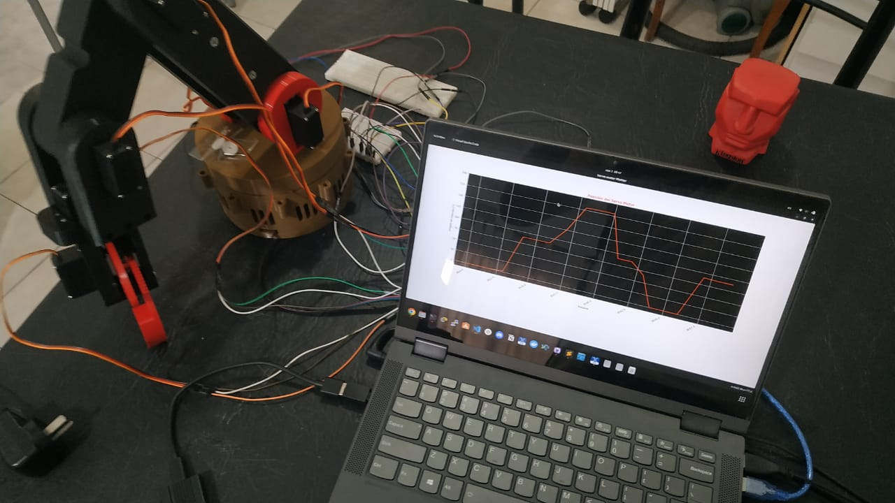
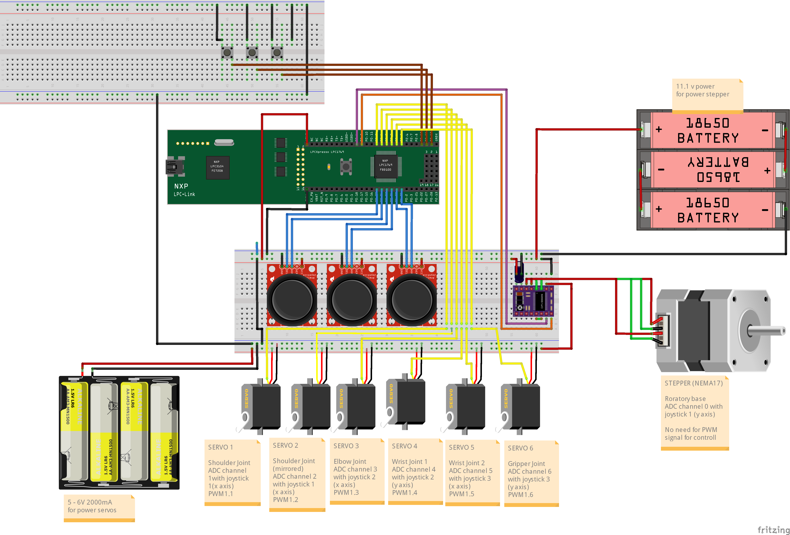
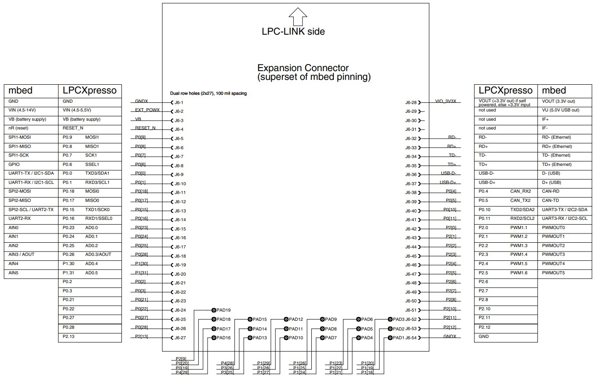

#   3D Printed Robotic Arm Using LPC1769 Microcontroller with Nema 17 stepper motor and MG996R servomotors + Phyton script for UART data plotting 
This work corresponds to the final project for the Digital Electronics 3 subject in FCEFyN - UNC, Argentina 2022

- IDE: [MCUXpresso IDE](https://www.nxp.com/design/software/development-software/mcuxpresso-software-and-tools-/mcuxpresso-integrated-development-environment-ide:MCUXpresso-IDE).
- Language: C , Python.
- Microcontroller: [LPCXpresso LPC1769 rev C](https://www.embeddedartists.com/products/lpc1769-lpcxpresso/).
- Library: adjunted
- Hardware Bloks in use: ADC, PWM, GPIO, EXTINT, UART, DMA.
---
## LPCXpresso LPC1769
 
 

---
## 3D Model
The 3D model of the robotic arm used for this project was designed by LimpSquid (https://github.com/limpsquid) and you can find it in his Thingiverse profile: https://www.thingiverse.com/limpsquid/designs
-This model was printed by a Ender3 Printer
---
Autors: @camilacareggio @ccasanueva7 @francoriba

E-mail: franco.riba@mi.unc.edu.ar
